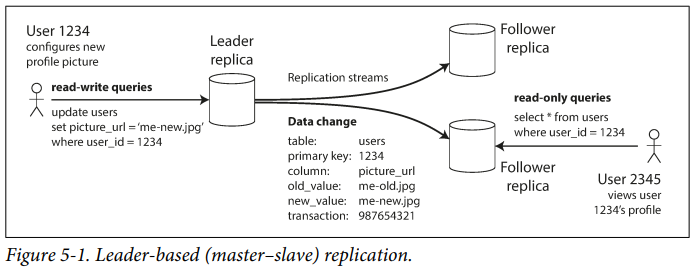
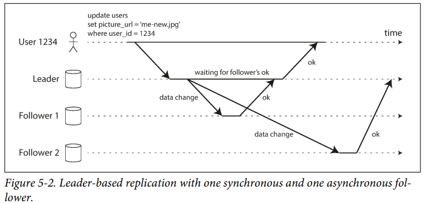
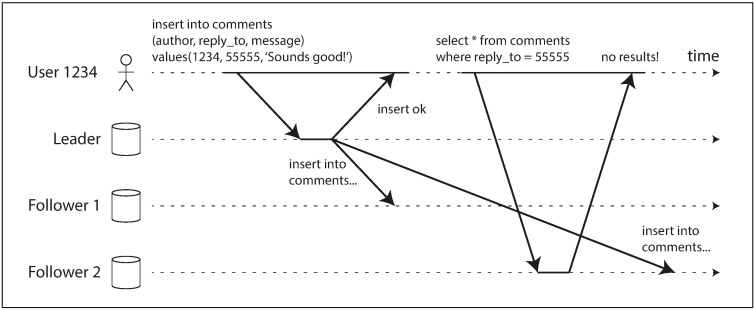
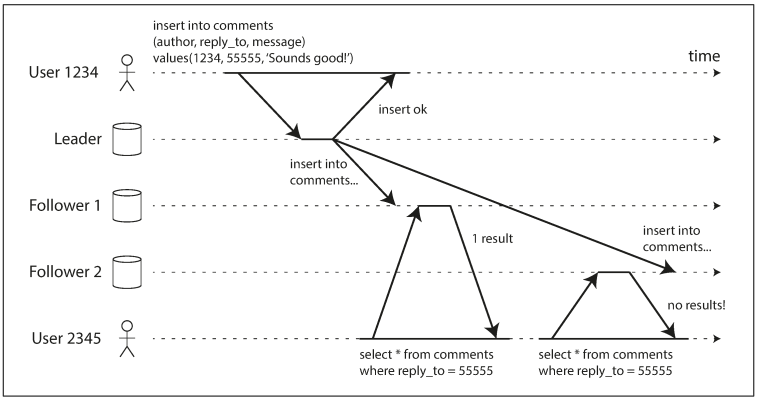
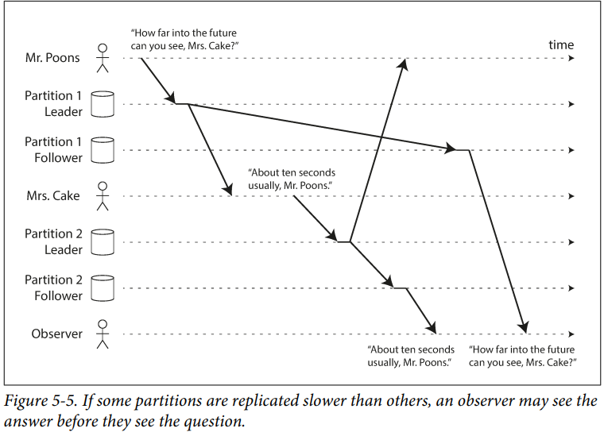

# Distributed Data (Part 2)
Part 1 - we discussed aspects of data systems that apply when data is stored on a single machine. In part 2, we’ll talk about it, when multiple machines are involved.

## Why multiple machines?
- Scalability
- Fault tolerance / High availability
- Latency

---

## Scaling to higher load / Vertical scaling / Scaling up

- Buy more powerful machines.
- Connect many CPUs, RAMs and disks under one OS.
- Shared-memory architecture, all components can be treated as single machine.
- Another approach is shared-disk architecture - independent CPUs and Ramp, but stores data on an array of disks which is shared between machines.
    - Due to locking and contention (multiple nodes trying to access the same data), adding more machines doesn't linerarly improve performance (thus limits scalability).

---

### Problem
- 2xCPUs, 2xRAM, 2xDisk != 2xLoad (and is more costlier than twice as much)
- Limited to a single geographic location


## Shared Nothing architectures / Horizontal Scaling / Scaling out
- Each machine/VM is called node.
- No special hardware is required. Coordination between nodes is done at the software level.

### Advantages
- You can use whatever machines have the best price/performance ration.
- Distribute data across multiple geographic regions - reduce latency.

---

Note: In the upcoming chapters, we will focus on "Horizontal Scaling". Why?
- If data is distributed across multiple nodes, you need to be aware of the constraints and trade-offs.

---

## Replication Versus Partitioning
There are two common ways data is distributed across multiple nodes:
### Replication
Keeping a copy of the same data on several different nodes, potentially in different locations. Replication provides redundancy: if some nodes are unavailable,
the data can still be served from the remaining nodes. Replication can also help
improve performance.

### Partitioning / Sharding
Splitting a big database into smaller subsets called partitions so that different partitions can be assigned to different nodes (also known as sharding).

---

# Chatpter 5 - Replication

Replication - keeping a copy of the same data on multiple machines, that are connected via a network.

## Benefits
- Low latency (data geographically close to users)
- Increased availability/fault tolerance
- Increase throughput (scale out number of machines that can serve read queries)

Note: In this chapter we assume that dataset is so small that each machine can hold a copy of entire dataset. (chater 6 will talk about sharding/partitioning , for larger datasets)

---

If the data that you’re replicating does not change over time, then replication is easy:
you just need to copy the data to every node once, and you’re done. All of the difficulty in replication lies in handling changes to replicated data, and that’s what this
chapter is about. We will discuss three popular algorithms for replicating changes
between nodes: <b>single-leader</b>, <b>multi-leader</b>, and <b>leaderless</b> replication.

---

## Leaders and Followers

- Each node that stores a copy of the db is called a <b>replica</b>.
- How do we keep data on replicas consistent?

---

- Leader-based replication
    - Clients send write requests to the leader, which first writes the new data to its local storage.
    - The leader then sends the data change to its followers/slaves as part of a <i>replication log</i> or <i>change stream</i>.
    - Each follower then updates its local copy of the database by writing in the same order 
    as that of leader.
    - If a client wants to read from DB, it can query either the leader or any of the followers. However, writes are only accepted on the leader.
    - This mode of replication is a built-in feature in many softwares, including PostgreSQL, MySQL, MongoDB, Espresso, Kafka.

---



---

## Synchronous VS Asynchronous Replication



- In the above image, Follower 1 is synchronous, while follower 2 is asynchronous.
- In synchronous replication, leader waits until follower 1 confirms the write, before reporting success to the user. While, in asynchronous replication, the leader doesn't wait for a response.

---

- Replication is normally quite fast. But sometimes, followers may fall behind the leader by several minutes or more:
    - when recovering from a failure
    - system is operating near max capacity
    - network problems between the nodes
- Advantage of sync replication is that follower always have up-to-date copy of data - consistent with the leader.
- Disadvante of sync replication is that if the follower doesn't respond, the write cannot be processed. The leader must block all writes and wait until the replica is available again.
- Any one node outage would cause the whole system to grind to a halt.
- In general, enabling sync replication on a DB, means that <i>one</i> of the followers is sync, and others are async ~ semi-synchronous.

---

- Often, leader-based replication is configured to be completely asynchronous - If the leader fails, and is not recoverable, any writes that have not yet been replicated to followers are lost - No guarantee of durability, even if the write has been confirmed to the client.
    - However, its advantage is that the leader can continue processing writes, even if all of its followers have fallen behind.

---

## Setting up New Followers

- There might be need to increase the num of replicas or to replace failed nodes. While adding a new follower, how do you ensure that it has an accurate copy of the leader's data?
- A standard file copy is efficient - data is always in flux.
- Cannot lock DB (making it unavailable for writes) as it goes agains the goal of high availabiity.
- Steps to add a new follower-
    - Take a consistent snapshot of leader's DB at some point in time. Most DBs have this feature.
    - Copy this snapshot to follower node.
    - Follower connects to the leader and requests all data changes since snapshot was taken: Follower is now <i>caught up</i>.

---

## Handling Node Outages

Our goal is to keep the system as a whole running despite individual node failures, and to keep the impact of a node outage as small as possible.

### Follower failure: Catch-up recovery

Each follower keeps a log of the data changes it has received from the leader. If a follower crashes, it can recover using its log.
- It knows the last transactions processed before the fault.
- It can request all the data changes since then from the leader, and continue receiving a stream of data changes as before.

---

### Leader failure: Failover

- If a leader fails, one of the follower needs to be promoted to be the new leader.
- Make clients aware to send their writes to the new leader.
- Make other followers aware to start consuming data changes from the new leader.
---
- This process is called failover. It consists of these steps:
    - Determine that the leader has failed (nodes bounce messages back and forth - if a node doesn't respond for some period of time, it is assumed to be dead)
    - Choosing a new leader:
        - Election process - remaining replicas choose a leader.
        - Controller node could choose a new leader.
    - Best candidate is usually a replica with the most up-to-date data changes from the old leader (to minimize any data loss).
    - Reconfiguring the system to use the new leader. The system needs to ensure that the old leader becomes a follower and recognizes the new leader.

---    

#### Failovers can go wrong

- In async replication, new leader may not have received all the writes from the old leader before it failed. If the former leader joins back, what should happen with those writes? Most common solution is to simply discard the writes on the former leader.
- Discarding writes is dangerous. Example - an out-of-date MySQL follower was promoted to leader, which reused some primary keys that were previously assigned by the old leader. These keys were also used by redis, which caused inconsistency between MySQL and Redis, and caused some private data to be disclosed to the wrong users.
    - [GitHub blog](https://github.blog/news-insights/the-library/github-availability-this-week/)
    ```
    "We detected this fact and powered off this out-of-date node at 8:26 AM to end the partition and prevent further data drift, taking down all production database access and thus all access to github.com.
    As a result of this data drift, inconsistencies between MySQL and other data stores in our infrastructure were possible. We use Redis to query dashboard event stream entries and repository routes from automatically generated MySQL ids. In situations where the id MySQL generated for a record is used to query data in Redis, the cross-data-store foreign key relationships became out of sync for records created during this window."
    ```
---    
- It could also happen that two nodes both believe that they are leaders - split brain.
    - If both accept writes, how do we resovle conflicts?
    - For safety, systems have mechanism to shut down one node if two leaders are detected - if not done carefully, it may shut down both nodes.

---

## Implementation of Replication Logs

There are several different replication methods used.

### Statement based replication

The leader logs every write request (statement) that it executes and sends to its followers.
- For relational DBs, the SQL statement is parsed and executed by the followers, as if it has been received from a client.
---
- Disadvantages:
    - Any nondeterministic function, such as NOW(), Rand(), will likely generate a different value on each replica.
    - If statements must be executed in exactly the same order, or else they may have different effects.
    - Statements that have side effects (like triggers, functions), may occur on each replica.
- It is possible to overcome these issues. Leader can replace any nondeterministic function calls with a fixed return value.

---

### Write-ahead log (WAL) shipping

The leader writes log (every modification/write) to the disk and also sends it across the netweork to its followers.
- Follower processes this log, and builds a copy of the exact same data structures as found of the leader.
- Disadvantage:
    - Log describes the data on a very low level: which bytes were changed in which disk blocks. This makes replication closely coupled to the storage engine. If DB changes its storage format from one version to another, if is not possible to run different versions of DB software on leader and the followers.

---

### Logical (row-based) log replication

Use different log formats for replication (logical log) and for the storage engine (physical) - allows decoupling of replication log from the storage engine internals.

A logical log for a relation DB is usually a sequence of records describing writes to DB tables at the granularity of a row.

Advantage: Leader and folower can run on different versions of DB software or even different storage enginers, since logical log is decoupled from the storage engine internals (backward compatible).

---

### Trigger-based replication

The previous replication approaches are implemented by DB systems, without involving any application code.
- There could be situations, when we need to move replication up to the application layer.
- Many relation DBs have features like: <i>triggers and stored procedures</i>.
- Trigger lets you register custom application code, which automatically executes on a write in DB. The external process can then apply any necessary application logic and replicate the data change to another system.
- It is more prone to bugs and limitations that DB's build-in replication. However, it is very useful due to its flexibility.

---

## Problems with Replication Lag

- Replication lag: Delay between a write happening on the leader and being reflected on a follower.
- Eventual consistency - If you run a read query on the leader and a follower at the same time, you may get different results, because not all writes have been reflected in the follower - However, this inconsistency is just a temporary state - followers will eventually catch up and become consistent with the leader.

---

### Reading your own writes

- Many applications lets user submit some data and then view what they have submitted (Instagram comments, etc..).
- The write is sent to the leader, and can be read from a follower.
- With asynchronous replication, the problem is that the new data may not yet have reached the replica, shortly after writing. User might feel that data they submitted was lost.



---

#### How can we implement read-after-write consistency with leader-based replication:

- When reading something that the user may have modified, read it from the leader; otherwise, read it from a follower.
    - For ex, user profile information on a social network is normally only editable by the owner of the profile, not by anybody else. Thus, a simple rule is: always read the user’s own profile from the leader, and any other users’ profiles from a follower.
---
- If most things in the application are potentially editable by the user, that approach won’t be effective, as most things would have to be read from the leader (negating the benefit of read scaling). In that case, other criteria may be
used to decide whether to read from the leader.     
    - For example, you could track the time of the last update and, for one minute after the last update, make all reads from the leader
    - You could also monitor the replication lag on followers and prevent queries on any follower that is more than one minute behind the leader.
---
- The client can remember the timestamp of its most recent write—then the system can ensure that the replica serving any reads for that user reflects updates at least until that timestamp.    
    - If a replica is not sufficiently up to date, either the read can be handled by another replica or the query can wait until the replica has

- If your replicas are distributed across multiple datacenters (for geographical proximity to users or for availability), there is additional complexity. Any request that needs to be served by the leader must be routed to the datacenter that contains the leader.

---

#### Cross-device read-after-write consistency

If the user enters some information on one device and then views it on another device, they should see the information they just entered.
In this case:

- Approaches that require remembering the timestamp of the user’s last update
become more difficult, because the code running on one device doesn’t know what updates have happened on the other device. This metadata will need to be centralized.

---

- If your replicas are distributed across different datacenters, there is no guarantee
that connections from different devices will be routed to the same datacenter.
    - (For example, if the user’s desktop computer uses the home broadband connection and their mobile device uses the cellular data network, the devices’ network routes may be completely different.) If your approach requires reading from the leader, you may first need to route requests from all of a user’s devices to the same datacenter.

---    

### Monotonic Reads

Problem: User moves backward in time.



---

- Monotonic reads is a guarantee that this kind of anamaly does not happen.
- It's a lesser guarantee than strong consistency, but a stron guarantee than eventual consistency.
- User will not read older data after having previously read newer data.
- One way of achieving this is to make sure each user always reads from the same replica (maybe chose replicas based on the hash of user ID).

---

### Consistent Prefix Reads



---

Consistent Prefix Reads: If a sequence of writes happens in a certain order, then anyone reading those writes will see them appear in the same order.

- One solution is to make sure that any writes that are causally related to each other are written to the same partition—but in some applications that cannot be done efficiently. There are also algorithms that explicitly keep track of causal dependencies (we'll talk about those in later chapters).